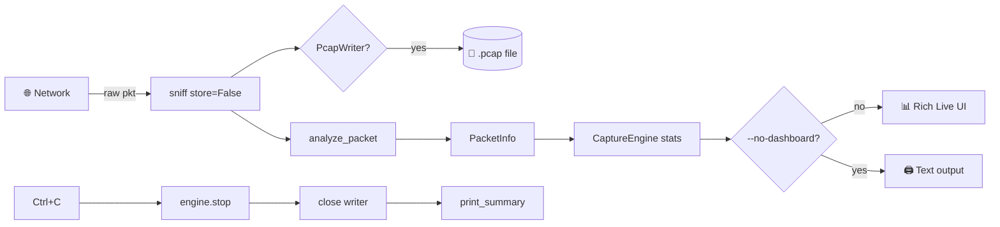

# 📡 NetSniff v2.0

<div align="center">


<br/>

[](https://python.org)
[](https://scapy.net)
[](https://github.com/Textualize/rich)
[](LICENSE)
[]()

<br/>

```
 ███▄    █ ▓█████▄▄▄█████▓   ██████  ███▄    █  ██▓  █████▒ █████▒
 ██ ▀█   █ ▓█   ▀▓  ██▒ ▓▒ ▒██    ▒  ██ ▀█   █ ▓██▒▓██   ▒▓██   ▒
▓██  ▀█ ██▒▒███  ▒ ▓██░ ▒░ ░ ▓██▄   ▓██  ▀█ ██▒▒██▒▒████ ░▒████ ░
▓██▒  ▐▌██▒▒▓█  ▄░ ▓██▓ ░    ▒   ██▒▓██▒  ▐▌██▒░██░░▓█▒  ░░▓█▒  ░
▒██░   ▓██░░▒████▒ ▒██▒ ░  ▒██████▒▒▒██░   ▓██░░██░░▒█░   ░▒█░
░ ▒░   ▒ ▒ ░░ ▒░ ░ ▒ ░░    ▒ ▒▓▒ ▒ ░░ ▒░   ▒ ▒ ░▓   ▒ ░    ▒ ░
░ ░░   ░ ▒░ ░ ░  ░   ░     ░ ░▒  ░ ░░ ░░   ░ ▒░ ▒ ░ ░      ░
   ░   ░ ░    ░    ░       ░  ░  ░     ░   ░ ░  ▒ ░ ░ ░    ░ ░
         ░    ░  ░               ░           ░  ░
```

### 🔥 Capture · Decode · Analyze · Visualize — in real time.

*A modern, testable, and dashboard-driven network packet analyzer built on **Scapy** and **Rich**.*

[Features](#-features) · [Install](#-installation) · [Usage](#-usage) · [Screenshots](#-screenshots) · [Architecture](#-architecture) · [Testing](#-testing) · [Ethics](#-legal--ethical-notice)

</div>

---

## ✨ Features

<div align="center">

| 🌐 **Live Capture** | 🔬 **Deep Decoding** | 📊 **Rich Dashboard** |
|:---:|:---:|:---:|
| BPF-filtered, interface-selectable sniffing | Ethernet → IP → TCP/UDP → App layer | Top talkers, protocol pie, live stats |
| **🔐 App-Layer** | 🧵 **TCP Streams** | 💾 **Streaming pcap** |
| HTTP Host + TLS SNI + DNS query extraction | `TCPSession` reconstruction | Zero-RAM-bloat packet writer |
| **🧪 Testable** | **🛡️ Graceful** | **📦 Portable** |
| `PacketInfo` dataclass + `--selftest` | Ctrl+C saves pcap & prints summary | Linux · macOS · Windows |

</div>

### 🎯 Highlights

- 🧩 **Structured output** — every packet becomes a `PacketInfo` dataclass (unit-testable, serializable)
- 🖥️ **Live terminal UI** — Rich dashboard with top talkers and protocol breakdown
- 🔍 **Application-aware** — decodes `Host:` headers, TLS `SNI`, and DNS `qname`
- 🧵 **TCP reassembly** — optional `TCPSession` for stream reconstruction
- 💽 **Streaming pcap** — never accumulates packets in RAM
- 🛑 **Graceful shutdown** — Ctrl+C flushes pcap *and* prints summary
- ⚠️ **Clear errors** — "Install Npcap", "Run as sudo", "No interface found"
- 🧪 **Offline self-test** — verify parsers without root privileges

---

## ⚡ Installation

### 1. Clone

```bash
git clone https://github.com/<your-username>/netsniff.git
cd netsniff
```

### 2. Install dependencies

```bash
pip install scapy rich
```

### 3. Platform prerequisites

<table>
<tr><th>OS</th><th>Requirement</th><th>Command</th></tr>
<tr><td>🐧 <b>Linux</b></td><td>libpcap + root</td><td><code>sudo apt install libpcap-dev</code></td></tr>
<tr><td>🍎 <b>macOS</b></td><td>libpcap (built-in) + sudo</td><td><code>brew install libpcap</code></td></tr>
<tr><td>🪟 <b>Windows</b></td><td>Npcap + Administrator</td><td><a href="https://npcap.com/">Download Npcap</a></td></tr>
</table>

---

## 🚀 Usage

### 🔎 List interfaces

```bash
python sniffer.py --list-ifaces
```

### 🧪 Self-test (no root needed)

```bash
python sniffer.py --selftest
```

### 📡 Live dashboard capture

```bash
sudo python sniffer.py -i eth0
```

### 🎯 Capture 50 HTTPS packets + save to pcap

```bash
sudo python sniffer.py -i eth0 -c 50 -f "tcp port 443" -o https.pcap --tcp-streams
```

### 🧾 Plain-text mode (great over SSH)

```bash
sudo python sniffer.py --no-dashboard -f "udp port 53"
```

### 🧰 Full CLI reference

| Flag | Description | Default |
|:-----|:------------|:-------:|
| `-i, --iface` | Interface name (`eth0`, `Wi-Fi`, …) | auto |
| `-c, --count` | Stop after N packets (`0` = unlimited) | `0` |
| `-f, --filter` | BPF filter (`tcp port 80`) | none |
| `-o, --output` | Save to `.pcap` file | none |
| `--tcp-streams` | Enable TCP stream reconstruction | off |
| `--no-dashboard` | Disable Rich UI, print text | off |
| `--list-ifaces` | List interfaces and exit | — |
| `--selftest` | Run offline parser tests | — |

---

## 📸 Screenshots

<div align="center">

### 🖥️ Live Dashboard

```
╭──────────────────────────────────────────────────────────────╮
│ 🔎 Live capture | packets=4821  elapsed=32.4s | Ctrl+C stop │
╰──────────────────────────────────────────────────────────────╯
╭─ Top Talkers ───────────────╮ ╭─ Protocols ───────────────╮
│ 192.168.1.10    1,204       │ │ TLS     2,109   43.7%     │
│ 142.250.72.14     987       │ │ TCP       901   18.7%     │
│ 8.8.8.8           542       │ │ DNS       712   14.8%     │
│ 10.0.0.5          431       │ │ HTTP      588   12.2%     │
│ 151.101.1.140     301       │ │ UDP       511   10.6%     │
╰─────────────────────────────╯ ╰───────────────────────────╯
```

### 📄 Plain-Text Output

```
==============================================================================
[+] Packet @ 14:22:07.612  |  92 bytes
  Ethernet : aa:bb:cc:11:22:33 -> ff:ee:dd:44:55:66  (0x0800)
  IPv4     : 192.168.1.10 -> 8.8.8.8  | TTL=64  proto=17
  UDP      : 40123 -> 53
  DNS      : query 'www.example.com'
  Payload  : 24 bytes  |  12 34 01 00 00 01 00 00 ... | .4....www...
```

</div>

---

## 🏗️ Architecture

```
sniffer.py
├── 📦 PacketInfo            # Structured, testable packet representation
├── 🔍 analyze_packet()      # Scapy pkt → PacketInfo (no printing)
├── 🧩 _extract_http()       # HTTP method + Host header
├── 🔐 _extract_tls_sni()    # TLS ClientHello SNI extraction
├── 🎛️ CaptureEngine         # sniff() + pcap writer + stats + TCPSession
├── 🖨️ print_packet_text()   # Non-dashboard renderer
├── 📊 build_dashboard()     # Rich layout: header + talkers + protos
├── 📝 print_summary()       # Post-capture statistics
├── 🧪 run_selftest()        # Offline assertions
└── 🚦 preflight_checks()    # Npcap / interface verification
```

### 🔄 Data Flow



---

## 🧪 Testing

```bash
$ python sniffer.py --selftest
[*] Running self-test ...
  [OK] TCP SYN parsed
  [OK] DNS query parsed
  [OK] HTTP Host parsed
  [OK] TLS SNI parsed
  [OK] flow_key correct
[+] Self-test passed (0 failures)
```

The self-test feeds **synthetic Scapy packets** through `analyze_packet()` — no root, no network, no dependencies. Perfect for CI.

### 🔁 CI Example

```yaml
# .github/workflows/test.yml
name: test
on: [push, pull_request]
jobs:
  selftest:
    runs-on: ubuntu-latest
    steps:
      - uses: actions/checkout@v4
      - uses: actions/setup-python@v5
        with: { python-version: '3.11' }
      - run: pip install scapy rich
      - run: python sniffer.py --selftest
```

---

## 📊 Packet Fields Reference

<div align="center">

| Layer | Extracted Fields | What It Teaches |
|:-----:|:-----------------|:----------------|
| **Ethernet** | `src`, `dst`, `type` | LAN delivery |
| **ARP** | `op`, `psrc`, `pdst` | IP ↔ MAC resolution |
| **IPv4/6** | `src`, `dst`, `ttl`, `proto` | End-to-end routing |
| **TCP** | `sport`, `dport`, `flags`, `seq`, `ack` | Reliable transport |
| **UDP** | `sport`, `dport`, `len` | Connectionless transport |
| **ICMP** | `type`, `code` | Ping / traceroute |
| **DNS** | `qname` | Name resolution |
| **HTTP** | `method`, `Host` | Web requests |
| **TLS** | `SNI` | HTTPS destination |
| **Raw** | hex + ASCII | Application payload |

</div>

---

## 🛡️ Legal & Ethical Notice

> ⚠️ **Only capture traffic on networks you own or have explicit written permission to monitor.**

Unauthorized interception may violate:

- 🇺🇸 **CFAA** (Computer Fraud and Abuse Act)
- 🇪🇺 **GDPR** (General Data Protection Regulation)
- 🇮🇳 **IT Act 2000** (India)
- 🇬🇧 **Computer Misuse Act**

Captured `.pcap` files may contain **credentials, tokens, and personal data in cleartext** — treat them as sensitive.

**This tool is for education, debugging, and authorized security research only.**

---

## 🗺️ Roadmap

- [ ] 🔬 ML-based anomaly detection (port scans, DNS tunneling)
- [ ] 📈 Export stats to Prometheus / Grafana
- [ ] 🧬 Full HTTP/2 + QUIC decoding
- [ ] 🎨 GeoIP enrichment on the dashboard
- [ ] 📼 Offline pcap replay mode with timeline scrubber

---

## 🤝 Contributing

```bash
# Fork, then:
git checkout -b feature/amazing-thing
git commit -m "feat: add amazing thing"
git push origin feature/amazing-thing
# Open a Pull Request 🎉
```

Please run `python sniffer.py --selftest` before submitting.

---

## 📜 License

Released under the **MIT License** — see [LICENSE](LICENSE) for details.

---

<div align="center">

### 🌟 If this helped you understand networks, drop a star!

<a href="https://github.com/<your-username>/netsniff/stargazers">
  /netsniff?style=for-the-badge&logo=github&color=FFD700" />
</a>

<br/><br/>

```
     ┌────────────────────────────────────────────────┐
     │  "The network is the computer."                │
     │                       — John Gage, Sun, 1984   │
     └────────────────────────────────────────────────┘
```

**Made with 🐍 Python · 🔬 Scapy · 🎨 Rich**

</div>

---

## 💡 Tips for Maximum GitHub Wow-Factor

1. **Animated banner** — replace the ASCII art with a real image (use [capsule-render](https://github.com/kyechan99/capsule-render)):
   ```markdown
   
   ```

2. **Terminal GIF** — record with [`asciinema`](https://asciinema.org) + [`agg`](https://github.com/asciinema/agg) or [vhs](https://github.com/charmbracelet/vhs).

3. **Shields.io badges** — add live build status:
   ```markdown
   [](...)
   ```

4. **Social preview** — upload a 1280×640 image in **Settings → Social preview**.

5. **Topics** — add in the repo About section: `python`, `scapy`, `packet-sniffer`, `network-analysis`, `cybersecurity`, `tcp-ip`, `rich`, `pcap`, `wireshark-alternative`.

6. **GitHub Pages demo** — if you build a web UI later, publish a live demo.

7. **README badges that link to something** — always wrap `` in `<a href>` so people can click through.
